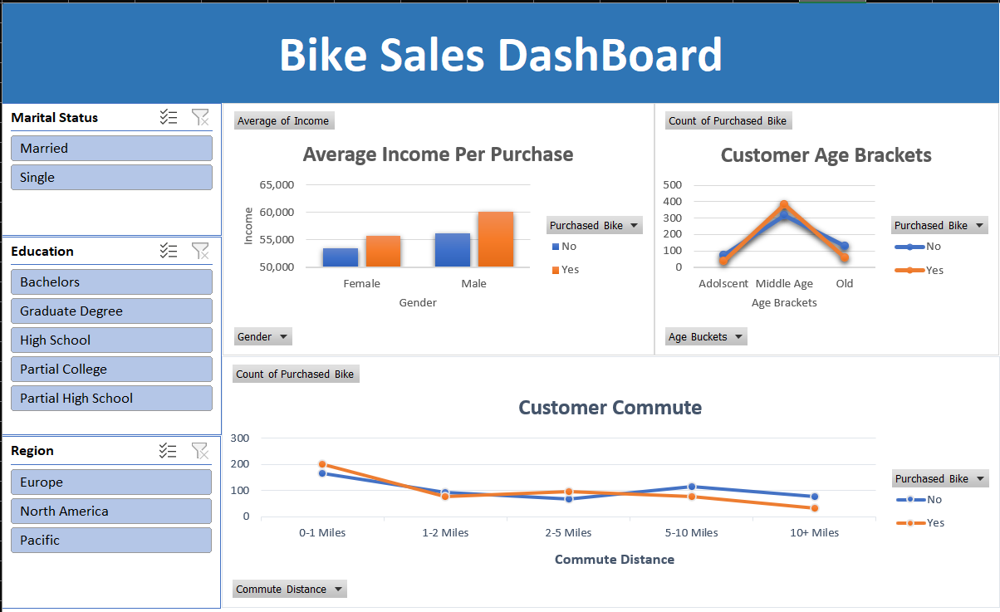
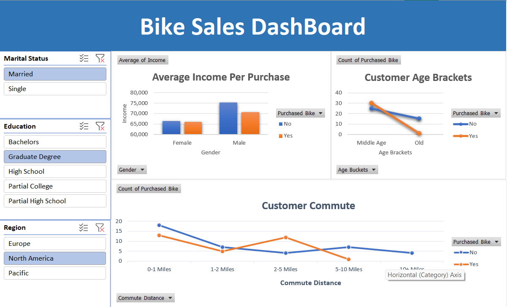
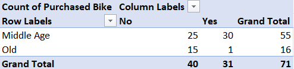

# Bike Sales Dashboard Analysis

## Project Overview

This project is an interactive Excel dashboard developed to analyze customer bike purchasing behavior using demographic and income-related data.

The dashboard transforms raw customer data into visual insights that help identify trends related to income, age groups, commute distance, and purchasing patterns.

The primary objective of this project was to practice data cleaning, analytical reporting, and dashboard development using Microsoft Excel.

---

# Objectives

- Clean and organize raw customer data
- Perform analysis using Pivot Tables
- Build an interactive dashboard using slicers and charts
- Extract meaningful business insights from customer purchasing behavior
- Improve dashboard design and reporting structure

---

# Dataset Information

The dataset contains customer demographic and purchasing information, including:

- Age
- Gender
- Income
- Education
- Occupation
- Marital Status
- Region
- Commute Distance
- Bike Purchase Status

---

# Tools & Features Used

- Microsoft Excel
- Pivot Tables
- Pivot Charts
- Slicers
- Interactive Dashboarding
- Data Cleaning
- Data Categorization
- Business Reporting

---

# Business Questions Explored

- Which customer age groups purchase bikes more frequently?
- Does income influence bike purchasing behavior?
- Which commute distance category has higher bike purchases?
- How do demographic factors impact purchase decisions?
- Which customer segments contribute most to bike sales?

---

# Dashboard Preview

## Main Dashboard

---

## Interactive Filtering

---

# Pivot Analysis

## Income Analysis

### Key Observation
Customers with higher average income showed a greater tendency to purchase bikes.

---

## Commute Distance Analysis

.png)

### Key Observation
Customers with shorter commute distances demonstrated higher bike purchase activity.

---

## Age Bracket Analysis

### Key Observation
Middle-aged customers represented the largest segment of bike purchasers.

---

# Dashboard Features

- Interactive slicers for dynamic filtering
- Pivot-based analytical reporting
- Comparative customer analysis
- Visual representation of purchasing trends
- Clean dashboard layout for business reporting

---

---

# Learning Outcomes

Through this project, I practiced:
- Structuring Excel-based analytical workflows
- Creating interactive dashboards
- Using Pivot Tables for business analysis
- Improving dashboard presentation
- Organizing portfolio projects professionally using GitHub

---
