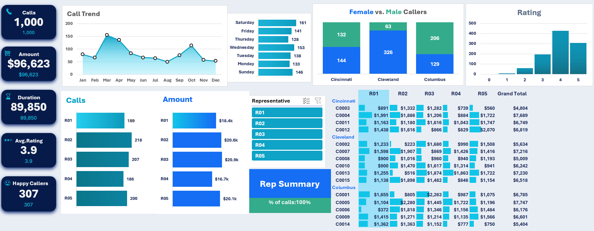
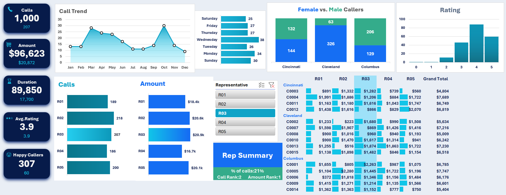
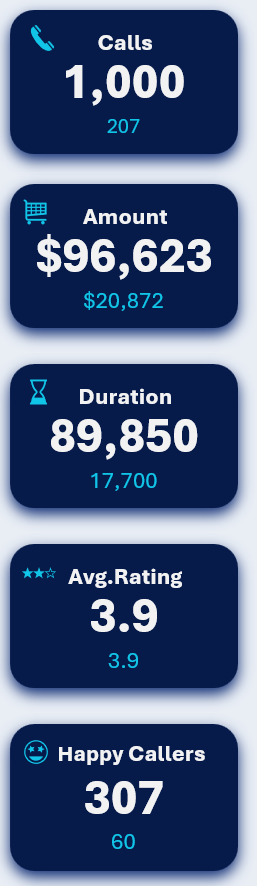
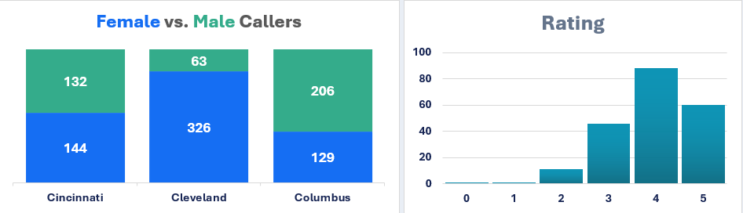
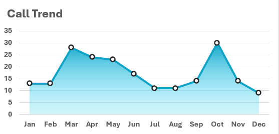
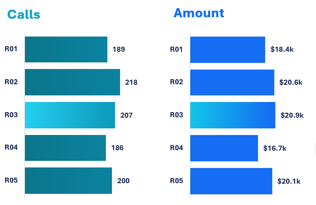

# Call Center Performance & Customer Analytics Dashboard

## Project Overview

This project is an interactive Excel dashboard developed to analyze call center operations, customer interactions, representative performance, and revenue-related metrics.

The dashboard transforms raw operational data into business-oriented insights using KPI reporting, interactive filtering, analytical visualizations, and performance tracking techniques.

The primary goal of this project was to simulate a real-world operational reporting dashboard using Microsoft Excel while improving analytical thinking, dashboard design, and business reporting skills.

---

# Objectives

- Analyze call center operational performance
- Track representative productivity and revenue contribution
- Monitor customer satisfaction trends
- Visualize customer interaction patterns
- Build an interactive dashboard using Excel
- Practice KPI reporting and analytical storytelling

---

# Dataset Information

The dataset contains operational and customer-related information including:

- Representative ID
- Customer ID
- Purchase Amount
- Call Duration
- Customer Ratings
- Call Dates
- Customer Gender
- City
- Day of Week
- Call Activity Metrics

---

# Tools & Features Used

- Microsoft Excel
- Pivot Tables
- Pivot Charts
- Slicers
- Conditional Formatting
- Interactive Dashboard Design
- KPI Reporting
- Heatmap Visualization
- Operational Reporting

---

# Business Questions Explored

- Which representatives generated the highest revenue?
- Which representatives handled the highest call volume?
- How does customer satisfaction vary across interactions?
- Which cities contributed the most customer activity?
- How do customer demographics impact call behavior?
- Which call periods generated higher activity?
- How do operational metrics vary across representatives?

---

# Dashboard Preview

## Main Dashboard

---

## Interactive Filtering

---

# KPI Overview

The dashboard includes operational KPI cards for:
- Total Calls
- Total Revenue
- Total Duration
- Average Customer Rating
- Happy Customer Count

These KPIs provide a high-level summary of call center performance and customer engagement.

---

# Customer Analysis

## Demographics & Satisfaction Analysis

This section analyzes:
- Female vs Male caller distribution
- Customer satisfaction ratings
---

## Customer Interaction Trends

This section focuses on:
- Monthly call activity trends
- Call distribution behavior over time
---

# Representative Performance Analysis

## Productivity & Revenue Contribution

This section compares:
- Total calls handled by representatives
- Revenue contribution by representatives
- Operational productivity metrics

---

## Detailed Representative Reporting

This section provides:
- Representative performance summaries
- Comparative operational reporting
- Dynamic representative filtering

---

# Dashboard Features

- Interactive slicers for dynamic filtering
- KPI-driven operational reporting
- Representative performance tracking
- Customer demographic analysis
- Revenue and call monitoring
- Trend and activity reporting
- Dynamic dashboard interactions

---

# Learning Outcomes

Through this project, I practiced:
- Building operational dashboards
- KPI-based business reporting
- Interactive dashboard development
- Performance analysis workflows
- Analytical storytelling
- Dashboard layout optimization
- Business-oriented data visualization

---
