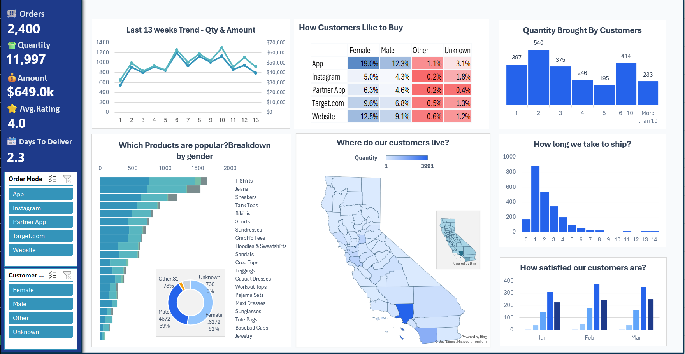
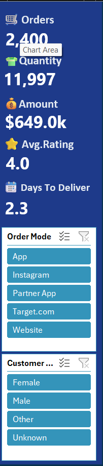
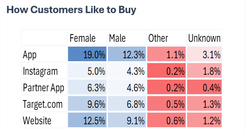
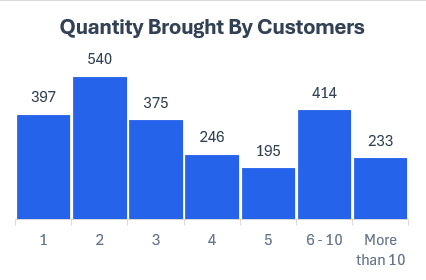
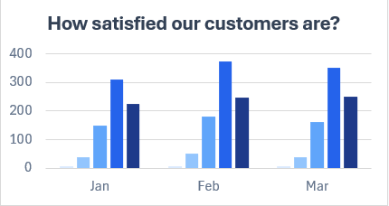
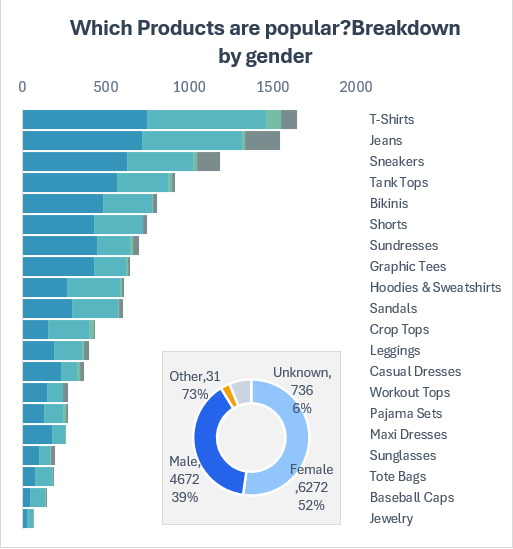
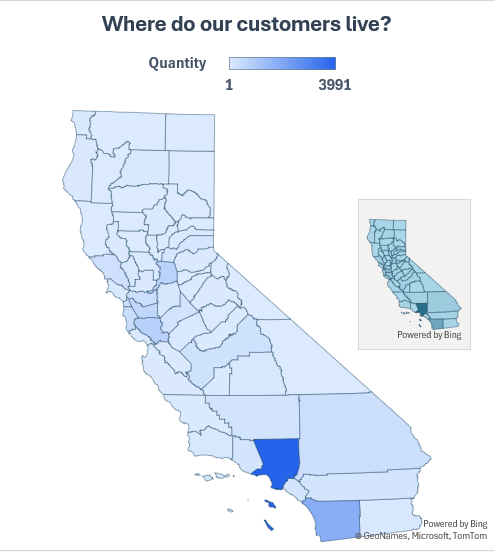

# E-Commerce Sales & Customer Analytics Dashboard

## Project Overview

This project is an interactive Excel dashboard designed to analyze e-commerce sales performance, customer purchasing behavior, product demand, delivery efficiency, and customer satisfaction.

The dashboard transforms transactional and customer data into actionable business insights through trend analysis, customer segmentation, geographic analysis, and operational performance monitoring.

The objective of this project was to simulate a real-world business intelligence dashboard using Microsoft Excel while strengthening data analysis, visualization, and reporting skills.

---
# Objectives

- Monitor overall sales performance and order activity
- Analyze customer purchasing behavior
- Identify popular products and sales trends
- Evaluate delivery performance
- Measure customer satisfaction levels
- Understand customer distribution across regions
- Build an executive-style reporting dashboard

---
# Dataset Information

The dataset contains e-commerce transaction and customer-related information, including:

- Order Details
- Product Information
- Customer Demographics
- Purchase Channels
- Order Quantity
- Revenue Metrics
- Customer Ratings
- Delivery Time
- Geographic Information
---

# Tools & Features Used

- Microsoft Excel
- Pivot Tables
- Pivot Charts
- Slicers
- Conditional Formatting
- Interactive Dashboard Design
- Customer Segmentation Analysis
- Geographic Visualization
- Sales Trend Analysis

---

# Business Questions Explored

- How have sales and quantities performed over the last 13 weeks?
- Which purchasing channels are most preferred by customers?
- Which products generate the highest demand?
- How does purchasing behavior differ across customer segments?
- Where are customers geographically concentrated?
- How efficiently are orders being delivered?
- How satisfied are customers with their purchases?
- What quantity ranges are most commonly purchased?

---

# Dashboard Preview

## Main Dashboard

---

# KPI Overview

### Insights

- The business processed **2,400 orders** resulting in **11,997 units sold**.
- Total revenue generated exceeded **$649K**.
- Customers reported a strong average satisfaction rating of **4.0/5**.
- Average delivery time remained relatively low at **2.3 days**.

---

# Customer Purchase Behavior

**Insight:** App and Website channels drove the highest purchase activity, with female customers contributing the largest share.

---

# Quantity Analysis

**Insight:** Most customers purchased between 1–3 items per order, with 2-item purchases being the most common.

---

# Customer Satisfaction Analysis

**Insight:** Customer ratings were predominantly 4 and 5 stars, indicating strong overall satisfaction.

---

# Product Performance Analysis

**Insight:** T-Shirts, Jeans, and Sneakers emerged as the highest-performing product categories across customer segments.

---

# Geographic Analysis

**Insight:** Customer demand was concentrated in a few high-performing regions, with Southern California showing the strongest activity.

---

# Dashboard Features

- Interactive filtering using slicers
- Executive KPI reporting
- Customer behavior analysis
- Product performance monitoring
- Geographic sales visualization
- Delivery performance tracking
- Customer satisfaction analysis
- Trend-based reporting

---

# Skills Demonstrated

- Data Cleaning
- Data Visualization
- Dashboard Design
- KPI Development
- Business Analysis
- Customer Analytics
- Sales Reporting
- Interactive Reporting
- Data Storytelling
- Excel Dashboard Development

---

# Learning Outcomes

Through this project, I practiced:

- Building executive-style dashboards
- Designing KPI-driven reports
- Analyzing customer behavior
- Tracking operational performance
- Creating interactive Excel dashboards
- Presenting business insights visually
- Structuring portfolio-ready analytical projects
